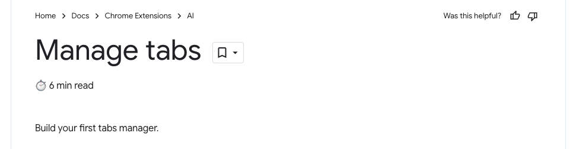

## Chrome Extension: Scripts on Every Tab

[ Original Tutorial Link ](https://developer.chrome.com/docs/extensions/get-started/tutorial/scripts-on-every-tab)

## Download .png file from the link pitfall

```zsh
wget https://github.com/GoogleChrome/chrome-extensions-samples/blob/main/functional-samples/tutorial.reading-time/images/icon-32.png // This will not work
```

> So I downloaded the image manually.

## You have to use do hard refresh to make it work

For example, this page:
https://developer.chrome.com/docs/extensions/get-started/tutorial/popup-tabs-manager

Cached version will not work. You have to do hard refresh to see the changes.


